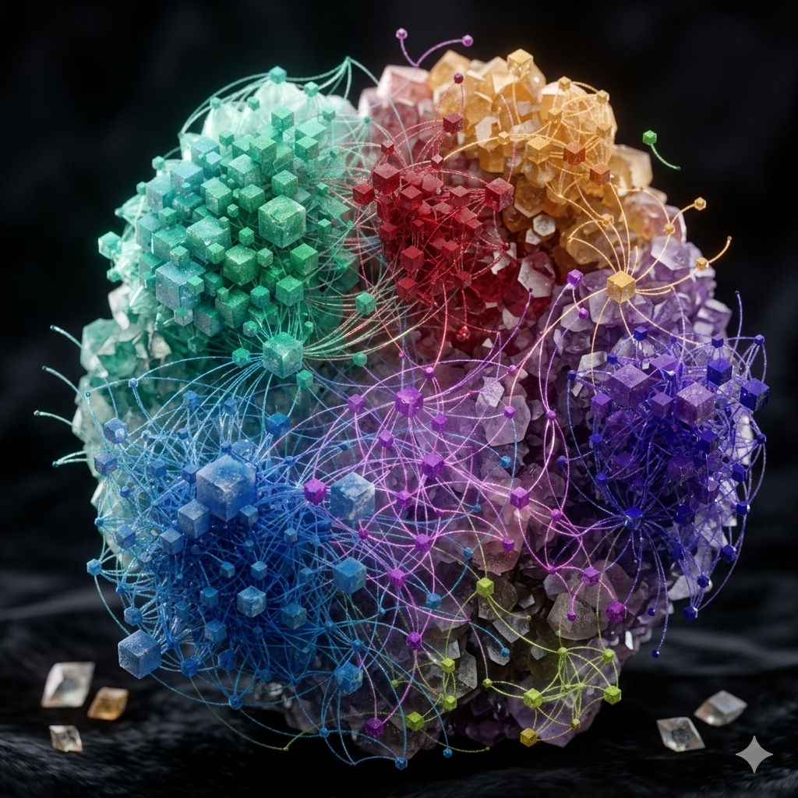

<div align="center">
  

# S3lf-c0n8ci0us

<p align="center">
  <a href="https://github.com/credkellar-boop/S3lf-c0n8ci0us/actions">
    
  </a>
  <a href="https://github.com/credkellar-boop/S3lf-c0n8ci0us/releases">
    
  </a>
  <a href="https://github.com/credkellar-boop/S3lf-c0n8ci0us/blob/main/LICENSE">
    
  </a>
</p>

<p align="center">
  
  
  
</p>

---

## 📖 Project Description

S3lf-c0n8ci0us is an advanced systems monitor merging a high-performance Rust agent with an intelligent Python analytical layer. Containerized via Docker and deployed on AWS EKS, it hooks directly into Gemini Cloud (Vertex AI) using Gemini 3.1 Pro's deep reasoning engine to autonomously analyze system telemetry anomalies, trace underlying architectural vulnerabilities, and execute automated response playbooks.

---

## 🧠 Core Architecture & Cognitive Framework

<p align="left">
  <a href="ARCHITECTURE.md">
    
  </a>
</p>

The internal decision engine of this repository executes an automated problem-solving lifecycle. To view the complete engineering diagrams detailing how the system builds baseline telemetry maps, analyzes deep system mutations, validates targets, and dynamically scales responses, read the dedicated [ARCHITECTURE.md](ARCHITECTURE.md) guide.

---

## 🛠️ Core Tech Stack

<p align="left">
  <a href="https://www.rust-lang.org/">
    
  </a>
  <a href="https://www.python.org/">
    
  </a>
  <a href="https://www.docker.com/">
    
  </a>
  <a href="https://github.com/features/actions">
    
  </a>
  <a href="https://cloud.google.com/vertex-ai">
    
  </a>
  <a href="https://deepmind.google/technologies/gemini/#introduction">
    
  </a>
</p>

---

## 🛡️ Cybersecurity DevOps

<p align="left">
  <a href="https://github.com/dependabot">
    
  </a>
  <a href="https://github.com/aquasecurity/trivy">
    
  </a>
  <a href="https://github.com/rustsec/rustsec">
    
  </a>
  <a href="https://github.com/PyCQA/bandit">
    
  </a>
  <a href="https://github.com/features/security">
    
  </a>
</p>

---

## 🏗️ Infrastructure & Cloud

<p align="left">
  <a href="https://aws.amazon.com/">
    
  </a>
  <a href="https://kubernetes.io/">
    
  </a>
  <a href="https://helm.sh/">
    
  </a>
  <a href="https://prometheus.io/">
    
  </a>
  <a href="https://grafana.com/">
    
  </a>
  <a href="https://www.postgresql.org/">
    
  </a>
</p>

---

## 📂 Project Organization

```text
├── .github/workflows/    # CI/CD pipelines (Trivy, Cargo Audit, Bandit)
├── src/                  # Core Systems Agent (Rust)
│   ├── main.rs
│   └── ...
├── analytics/            # Intelligence & Telemetry Layer (Python)
│   ├── main.py
│   ├── ai_reasoning.py   # Gemini 3.1 Pro Extended Reasoning Module
│   └── requirements.txt
├── deployments/          # Infrastructure orchestration manifests
│   └── helm/             # Kubernetes Helm Charts
├── .dockerignore
├── ARCHITECTURE.md       # Cognitive problem-solving loop specification
├── Dockerfile            # Optimized Multi-Stage Build Configuration
└── README.md


---

## 📖 Table of Contents
* [Overview](#-overview)
* [System Architecture](#-system-architecture)
* [Key Features](#-key-features)
* [Prerequisites](#-prerequisites)
* [Getting Started](#-getting-started)
* [Testing](#-testing)
* [Deployment](#-deployment)
* [Contributing](#-contributing)
* [License](#-license)

---

## 🧠 Overview

**S3lf-c0n8ci0Us** is a hybrid cognitive architecture designed to simulate layered processing environments. By splitting the stack between a highly performant compiled core (Rust) and an adaptable surface processing layer (Python), it establishes a robust framework for meta-learning, autonomous navigation, and dynamic biological-digital bridging. 

---

## 🏗 System Architecture

The repository is modularized into four primary cognitive layers:

### 1. `cognitive_core/` (Rust)
The engine's foundational layer. Written in Rust for memory safety and zero-cost abstractions. It handles heavy computational lifting, foundational memory routing, and low-level system interactions.

### 2. `conscious_surface/` (Python)
The sensory and control layer. Manages real-time data ingestion, biometric bridging, and top-level orchestrations.
* **Core Components:** `master_controller.py`, `autonomous_nav.py`, `biological_bridge.py`, `biosample_ingest/`.

### 3. `meta_learning/` (Python)
The self-improvement engine. Evaluates system performance and optimizes internal pathways dynamically.
* **Core Components:** `recursive_optimizer.py`.

### 4. `subconscious_lib/` (Knowledge & Heuristics)
A library of systemic frameworks and decision-making models (e.g., Cynefin framework, First Principles thinking, Systems Analysis, Root Cause resolution) mapped into actionable logic.

---

## ✨ Key Features

* **Biometric & Biological Bridging:** Ingest and process complex biological sample data via the `biosample_ingest` pipeline.
* **Recursive Optimization:** Continuous self-improvement loops utilizing the `meta_learning` module.
* **Autonomous Navigation:** Adaptive pathway mapping and operational autonomy via `autonomous_nav.py`.
* **Multi-Language Synergy:** Seamless data passing between Rust (`cognitive_core`) and Python (`conscious_surface`).
* **Containerized Deployment:** Fully reproducible environments using Docker and `docker-compose`.

---

## ⚙️ Prerequisites

To run this project locally, ensure you have the following installed:

* [Docker](https://docs.docker.com/get-docker/) & [Docker Compose](https://docs.docker.com/compose/install/)
* [Rust](https://rustup.rs/) (v1.70+ recommended)
* [Python](https://www.python.org/downloads/) (v3.10+ recommended)
* [Make](https://www.gnu.org/software/make/)

---

## 🚀 Getting Started

**1. Clone the repository:**
```bash
git clone [https://github.com/](https://github.com/)<YOUR_GITHUB_USERNAME>/S3lf-c0n8ci0Us.git
cd S3lf-c0n8ci0Us
